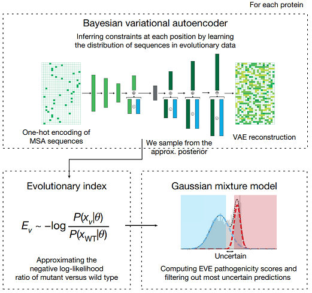

# eve-pytorch



Implementation of evolutionary model of variant effect (EVE), a deep generative model of evolutionary data, in PyTorch. It's just an re-implementation of the official model for my own learning purpose, which is also implemented in PyTorch. The official implementation can be found [here](https://github.com/OATML-Markslab/EVE).

## Installation
```bash
$ pip install eve-pytorch
```

## Usage
```python
import torch
from eve_pytorch import EVE

SEQ_LEN = 1000
ALPHABET_SIZE = 21

model = EVE(seq_len=SEQ_LEN, alphabet_size=ALPHABET_SIZE)

# ... training ...

x = torch.randn(1, 4, 1000)

# If you want to get the reconstructed sequence only,
x_reconstructed = model(x, return_latent=False)

# or, if you want to get the latent variables
x_reconstructed, z_mu, z_log_var = model(x, return_latent=True)
```

## Training
```bash
$ python -m eve_pytorch.train \
  --msa data/msa.filtered.a2m  \ # Multiple sequence alignment.
  --output ckpts/best_checkpoint.pt \
  --use-wandb  # Optional, for logging
```

## Computing evolutionary index
The authors defined an **evolutionary index** of a protein variant as the relative fitness of mutated sequence $\mathbf{s}$ compared with that of a wildtype sequence $\mathbf{w}$. Since computing the exact log-likelihood is intractable, the authors approximated the log-likelihood ratio of the two sequences as the difference between the ELBO of the two sequences:

$$ELBO(\mathbf{w}) - ELBO(\mathbf{s})$$

In this reproduction, I implemented `EVE.compute_evolutionary_index()` method to compute the evolutionary index of a protein variant. The method takes two sequences as input, and returns the evolutionary index of the variant. Optionally, you can tweak `num_samples` parameter to control the number of samples for the Monte Carlo sampling of latent vectors.

```python
import torch
from eve_pytorch import EVE

SEQ_LEN = 1000
ALPHABET_SIZE = 21

model = EVE(seq_len=SEQ_LEN, alphabet_size=ALPHABET_SIZE)
model.load_state_dict(torch.load('path/to/best/checkpoint.pt'))

wt_seq = # One-hot encoded wildtype amino acid sequence.
mut_seq = # One-hot encoded mutated amino acid sequence.

model.eval()
with torch.no_grad():
  model.compute_evolutionary_index(wt_seq, mut_seq, num_samples=20_000)
```

### Example
The example below shows how to compute the evolutionary indices of three variants in TP53 gene.
F109Q and V173Y are pathogenic variants, while R273C is a benign variant.
Note the difference of the evolutionary indices between the pathogenic variants and the benign variant.
```python
    from Bio import SeqIO

    def get_sequence_length(a2m_fp):
        """Get the sequence length of the first sequence in the a2m file.
        a2m_fp: Path to a2m file.
        """
        for record in SeqIO.parse(a2m_fp, "fasta"):
            return len(record.seq)
        
    a2i = {a:i for i, a in enumerate('ACDEFGHIKLMNPQRSTVWY-')}
    def one_hot_encode_amino_acid(sequence):
        return torch.eye(len(a2i))[[a2i[a] for a in sequence]].T
        
    model = EVE(seq_len=100).cuda()

    msa = 'data/P53_HUMAN_b01.filtered.a2m'
    ALPHABET_SIZE = 21

    print('Loading pretrained model.')
    model = EVE(seq_len=get_sequence_length(msa), alphabet_size=ALPHABET_SIZE)
    model.load_state_dict(torch.load('ckpts/TP53.best.pt'))
    model.cuda()

    wt_seq = """LSPDDIEQWFTEDPGDEAPRMPEAAPPVAPAPAAPTPAAPAPAPSWPLSSSVPSQKTYQG
SYGFRLGFLHSGTAKSVTCTYSPALNKMFCQLAKTCPVQLWVDSTPPPGTRVRAMAIYKQ
SQHMTEVVRRCPHHERCSDSDGLAPPQHLIRVEGNLRVEYLDDRNTFRHSVVVPYEPPEV
GSDCTTIHYNYMCNSSCMGGMNRRPILTIITLEDSSGNLLGRNSFEVRVCACPGRDRRTE
EENLRKKGEPHHELPPGSTKRALPNNTSSSPQPKKKPLDGEYFTLQIRGRERFEMFRELN
EALELKDAQAGKEPGGSRAHSSHLKSKKG""".replace('\n', '')

    # F109Q
    mut_seq_pathogenic1 = """LSPDDIEQWFTEDPGDEAPRMPEAAPPVAPAPAAPTPAAPAPAPSWPLSSSVPSQKTYQG
SYGQRLGFLHSGTAKSVTCTYSPALNKMFCQLAKTCPVQLWVDSTPPPGTRVRAMAIYKQ
SQHMTEVVRRCPHHERCSDSDGLAPPQHLIRVEGNLRVEYLDDRNTFRHSVVVPYEPPEV
GSDCTTIHYNYMCNSSCMGGMNRRPILTIITLEDSSGNLLGRNSFEVRVCACPGRDRRTE
EENLRKKGEPHHELPPGSTKRALPNNTSSSPQPKKKPLDGEYFTLQIRGRERFEMFRELN
EALELKDAQAGKEPGGSRAHSSHLKSKKG""".replace('\n', '')
    
    # V173Y
    mut_seq_pathogenic2 = """LSPDDIEQWFTEDPGDEAPRMPEAAPPVAPAPAAPTPAAPAPAPSWPLSSSVPSQKTYQG
SYGFRLGFLHSGTAKSVTCTYSPALNKMFCQLAKTCPVQLWVDSTPPPGTRVRAMAIYKQ
SQHMTEVYRRCPHHERCSDSDGLAPPQHLIRVEGNLRVEYLDDRNTFRHSVVVPYEPPEV
GSDCTTIHYNYMCNSSCMGGMNRRPILTIITLEDSSGNLLGRNSFEVRVCACPGRDRRTE
EENLRKKGEPHHELPPGSTKRALPNNTSSSPQPKKKPLDGEYFTLQIRGRERFEMFRELN
EALELKDAQAGKEPGGSRAHSSHLKSKKG""".replace('\n', '')

    # M66V
    mut_seq_benign = """LSPDDIEQWFTEDPGDEAPRVPEAAPPVAPAPAAPTPAAPAPAPSWPLSSSVPSQKTYQG
SYGFRLGFLHSGTAKSVTCTYSPALNKMFCQLAKTCPVQLWVDSTPPPGTRVRAMAIYKQ
SQHMTEVVRRCPHHERCSDSDGLAPPQHLIRVEGNLRVEYLDDRNTFRHSVVVPYEPPEV
GSDCTTIHYNYMCNSSCMGGMNRRPILTIITLEDSSGNLLGRNSFEVRVCACPGRDRRTE
EENLRKKGEPHHELPPGSTKRALPNNTSSSPQPKKKPLDGEYFTLQIRGRERFEMFRELN
EALELKDAQAGKEPGGSRAHSSHLKSKKG""".replace('\n', '')

    wt_seq, mut_seq_benign, mut_seq_pathogenic1, mut_seq_pathogenic2 = map(
        lambda x: one_hot_encode_amino_acid(x).cuda(),
        [wt_seq, mut_seq_benign, mut_seq_pathogenic1, mut_seq_pathogenic2]
    )

    model.eval()
    with torch.no_grad():
        print(model.compute_evolutionary_index(wt_seq, mut_seq_pathogenic1))  # 9.0448 (may vary slightly)
        print(model.compute_evolutionary_index(wt_seq, mut_seq_pathogenic2))  # 11.9176 (may vary slightly)
        print(model.compute_evolutionary_index(wt_seq, mut_seq_benign))       # -0.4336 (may vary slightly)

```

## Citations

```bibtex
@article{frazer2021disease,
  title={Disease variant prediction with deep generative models of evolutionary data},
  author={Frazer, Jonathan and Notin, Pascal and Dias, Mafalda and Gomez, Aidan and Min, Joseph K and Brock, Kelly and Gal, Yarin and Marks, Debora S},
  journal={Nature},
  volume={599},
  number={7883},
  pages={91--95},
  year={2021},
  publisher={Nature Publishing Group UK London}
}
```